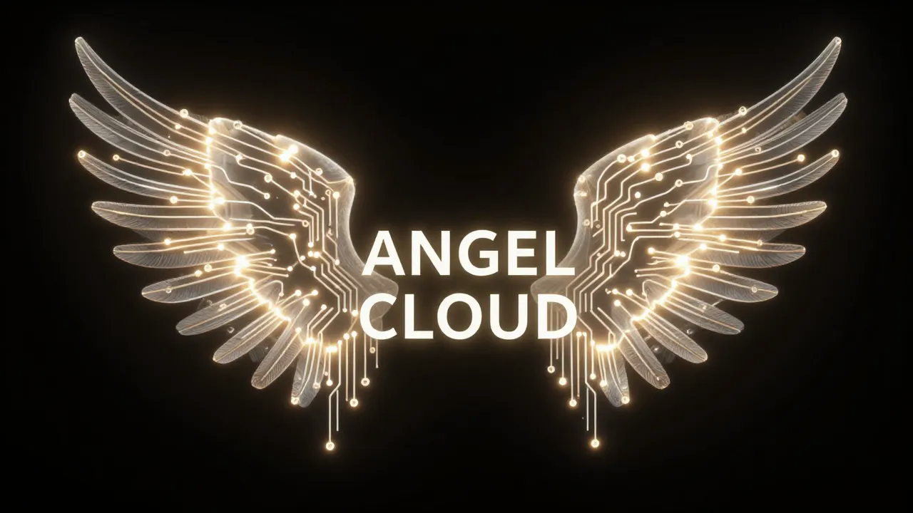

[](https://github.com/thebardchat/constitution)
[](#architecture-current)
[](./LICENSE)

# Angel Cloud

**A faith-rooted, local-first mental-wellness and creative safe haven — the public face of ShaneBrain.**

Named after Angel Brazelton. Built for the ~800 million people Big Tech is about to leave behind. Faith. Family. Sobriety. Community.

> **Source of truth:** [`angel-cloud-spec.md`](./angel-cloud-spec.md) is the locked vision. This README is the welcome mat; the spec is the blueprint. If the two ever disagree, the spec wins.

---

## What It Is

Angel Cloud inverts the login. You don't enter with a password — **you prove an uplifting state of being and earn your way in.** The security filter and the human filter are the same gate. It gamifies *human flourishing* instead of farming attention for clicks.

## First Principles

- **The filter IS the feature** — entry is a positive reset, not a password
- **Pro-social, never attention-farming** — reward lifting others up, not engagement
- **Sovereign by default** — zero-knowledge; your data stays yours, even from us
- **Local-first** — runs on owned hardware, not someone else's cloud
- **You own it** — Big Tech rents
- **Built for the left-behind** — the underserved are the point

## How You Move Through It

- **The Welcome Center** — one gated door, a warm 1998 / AOL-era feel. **GABE** the doorman reads your state; **Halos** verify trust over time. No standard login.
- **Identity arc: New Born → Born Again → Angel[Name].** You enter under a handle *given* from the Gospels — a follower's name, a place He walked, an image from His story — sealed with a number that points to a passage of hope (e.g. `DoveofJordan4031` → Isaiah 40:31). You earn your wings and claim your own name at a ceremony.
- **Halos, not likes** — earned only by real, verified acts that **support, teach, or comfort** another person.
- **The Crisis Covenant** — if someone is falling, **the machine never acts alone on a life: AI flags, a human decides, always.** Built *with* clinical input, opt-in only. This is the heart of the whole thing.
- **Angels Build Worlds** — once you're Born Again you build your own customizable space — the creative, self-owned web (the thing MySpace proved people want and Big Tech flattened).

## Architecture (current)

The **ShaneBrain Engine**: **Claude** (intelligence) + **Weaviate** (memory) + **MCP** (nervous system) + **text2vec-transformers / all-MiniLM-L6-v2** (local embeddings). Local-first, zero-knowledge, running on a Raspberry Pi 5 + mini-PC mesh over Tailscale. A hosted lane exists for people who can't self-host — and making *hosted* still feel like *yours* is the central engineering problem.

> ⚠️ **Legacy note.** Earlier iterations of this repo were a different thing: a Node/Express + MongoDB/Firestore + Google Sheets dispatch tool with Ollama/Gemini. **That era is superseded** — see [`LEGACY.md`](./LEGACY.md). Do **not** build on Ollama, Firestore, MongoDB, or any Google-Sheets/Drive dependency. Embeddings are text2vec-transformers / MiniLM only.

## Repo Structure (current bones)

```
angel-cloud/
├── angel-cloud-spec.md     # THE source of truth (vision, locked)
├── auth-bridge/            # the Welcome Center gate / trust + security bridge
├── welcome_center/         # the door — retro Welcome Center + New Born naming
├── build-our-worlds/       # "Angels Build Worlds" — your customizable space
├── bots/                   # the MEGA Crew (Arc gatekeeps; the local AI inhabitants)
├── memory-exports/         # memory continuity
├── LEGACY.md               # what's superseded — do not build on it
└── legacy/                 # quarantined pre-pivot code (kept for reference)
```

## Status

Vision **locked**. Front door **decided** — retro AOL, 2D (3D / Roblox rejected). Currently building the Welcome Center + New Born naming. See the spec for the full picture.

---

## Built With

| | | |
| --- | --- | --- |
| **Claude by Anthropic** — AI partner and co-builder. [`claude.ai`](https://claude.ai) | **Raspberry Pi 5** — local AI compute node. [`raspberrypi.com`](https://www.raspberrypi.com) | **Pironman 5-MAX** — NVMe RAID 1 chassis by SunFounder. [`sunfounder.com`](https://www.sunfounder.com) |

## Support This Work

If what I'm building matters to you — local AI for real people, tools for the left-behind — here's how to help:

- **[Sponsor me on GitHub](https://github.com/sponsors/thebardchat)**
- **[Buy the book](https://www.amazon.com/Probably-Think-This-Book-About/dp/B0GT25R5FD)** — *You Probably Think This Book Is About You*
- **Star the repo** — visibility matters for projects like this

Built by **Shane Brazelton** · Co-built with **Claude** (Anthropic) · Hazel Green, Alabama

---

*Part of the [ShaneBrain Ecosystem](https://github.com/thebardchat) · Governed by the [Constitution](https://github.com/thebardchat/constitution) — one link, one source, no drift.*
